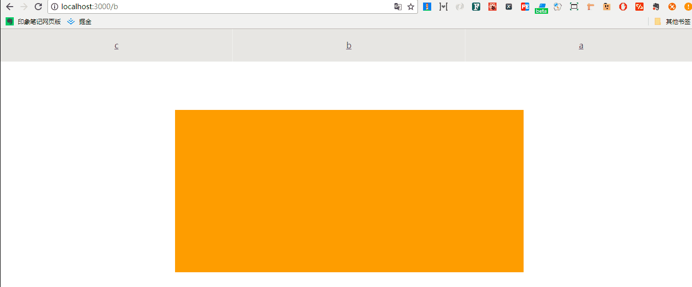
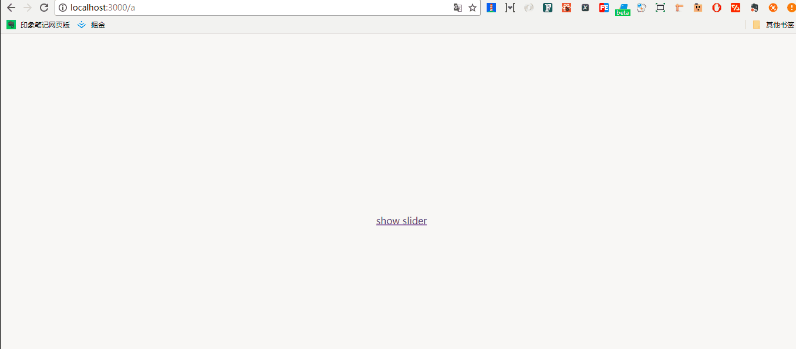

# react-router + react-motion

> inspired by react-motiom  & react-router-v4 & react-motion-router

## why react-motion ?

[react-motion][1] 是一个提供缓动函数的库，其原理可以参考 [点这里][2]。

[react-motion][1] 中的 TransitionMotion API，其说明是：

>Helps you to do mounting and unmounting animation.

这里，TransitionMotion 与 react-router 结合可以实现路由的动画。

## TransitionMotion

首先了解 TransitionMotion 的参数：

TransitionStyle ：{key: , data: ? , style: }

1. defaultStyles  初始样式，这个样式在后续的渲染中会被忽略。

2. styles (prevInterpolatedStyles=> Array<PlainStyle>) prevInterpolatedStyles 参数在没有 defaultStyles 的时候，<strong>第一次渲染</strong>是 undefined。返回的一个数组，含有目标值 [{key: , style: , data : ?}]。这里的 key和style是必须的，而且key很重要，因为 TransitionMotion 根据这个 key 来追踪渲染目标的配置。styles 就是 TransitionStyle 的集合。

3.  willLeave：(styleThatLeft: TransitionStyle) => ?Style
    如其名，将要离开的时候的状态，styleThatLeft 来自于传入的 styles 数组，由 key 唯一标识。这个 key 如果在前一次的渲染中存在，而现在则没有了，说明动画完事儿，就会由此触发 willLeave 事件。如果你返回的是 null，就表明你想让 TransitionStyle 立即消失。

4.  willEnter: (styleThatEntered: TransitionStyle) => PlainStyle
    将要进入的时候的状态，styleThatEntered 同 willLeave 的差不多，它触发的时机就是 key 在最后的渲染中不存在，但是现在存在了，那说明就是将要进入动画的时机了。
    注意最后返回的是 PlainStyle ，就是不含有 spring() 函数。

5.  didLeave: (styleThatLeft: {key: string, data?: any}) => void
    动画最终完成的时候就会移除 styleThatLeft。


## react-router

我们实现 route 和 swith 的动画组件，注意为了监听路由，我们需要传入 location。

## TransitionModel 的实现

我们封装一个 TransitionModel 组件，然后用它来封装我们的 route 和 swith。

首先 TransitionModel 最终返回的应该是一个 TransitionMotion。

```jsx
<TransitionMotion
    defaultStyles={this.getDefaultStyles()}
    styles={this.getStyles()}
    willEnter={this.willEnter}
    willLeave={this.willLeave}
    didLeave={this.didLeave}
>
{this.renderRoutes}
<\/TransitionMotion>
```

主要的 willEnter, willLeave, didLeave 函数最终的作用就是返回一个状态，表示进入或者退出动画的时候应该是什么，这个我们交给调用者控制(通过props传入)。

```jsx
willEnter = () => this.props.willEnter
willLeave = () => ensureSpring(this.props.willLeave)
didLeave = (styleThatLeft) => this.props.didLeave && this.props.didLeave(styleThatLeft)
```

最终我们需要的 <Route> <Swith> 组件可以作为子组件放进去， 通过 createElement, cloneElement 方法。

```jsx
renderRoute = (config) => {
    const props = {
        style: this.props.mapStyles(config.style),
        key: config.key
    }

    return this.props.wrapperComponent !== false ?
        createElement(this.props.wrapperComponent, props, config.data) :
        cloneElement(config.data, props);
}

renderRoutes = interpolatedStyles => 
(
    <div className={this.props.className}>
        {
            interpolatedStyles.map(this.renderRoute)
        }       
    <\/div>
)
```

## TransitionRoute 

```jsx
const getKey = ({pathname}, exact, path) => {
    return matchPath(pathname, {exact, path}) ? 'match' : 'no-match';
}

export const TransitionRoute = ({component, exact, path, ...rest}) => {
    return (
        <Route 
            render={({location, match}) => (
                <TransitionModel {...rest}>
                    <Route 
                        key = {getKey(location, exact, path)}
                        path = {path}
                        exact = {exact}
                        component = {component}
                        location = {location}
                    \/>
                <\/TransitionModel>
            )}
        \/>
    )
}
```

传入 location 是为了可以监听路由变化，不会 block，key 在前边也说了，很重要，是最终 TransitionStyle 的标识。

这里只有一个子组件，所以我们可以通过 matchPath 为其配置匹配和不匹配情况下的 key 值，这里的 key 如果换成 Math.random() 就追踪不到动画了，可以思考一下为什么？


## TransitionSwitch

稍微复杂点，我们可以通过 Route 的 children 方法实现（官网也说了这就是天生为动画准备的啊）。

```jsx
const SwitchWrapper = (props) => {
    return (
        <Route 
            children={({location})=>(
                <TransitionSwitch location={location} {...props} \/>
            )}
        \/>
    )
}
```

因为 Switch 下边多个 Route 组件在切换的时候，可以通过 componentWillReceiveProps 获取到 nextProps.location，我们可以通过这个方法为每一个子组件绑定一个 key，然后实现动画，代码就不贴了，末尾会给出 github 地址。


## 效果

Route:




Switch:




[1]: https://github.com/chenglou/react-motion
[2]: https://segmentfault.com/a/1190000004224778

